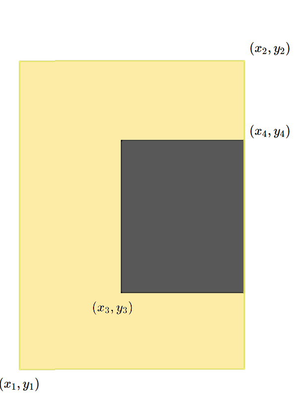
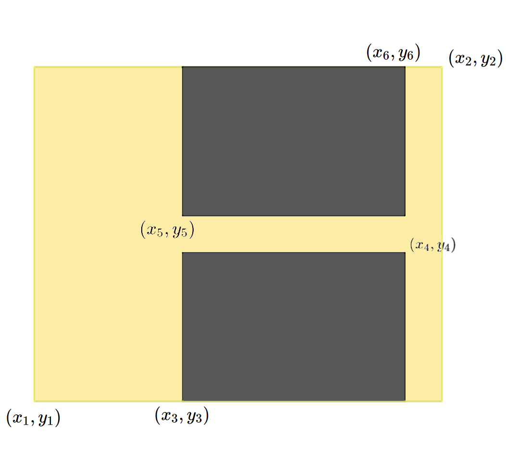
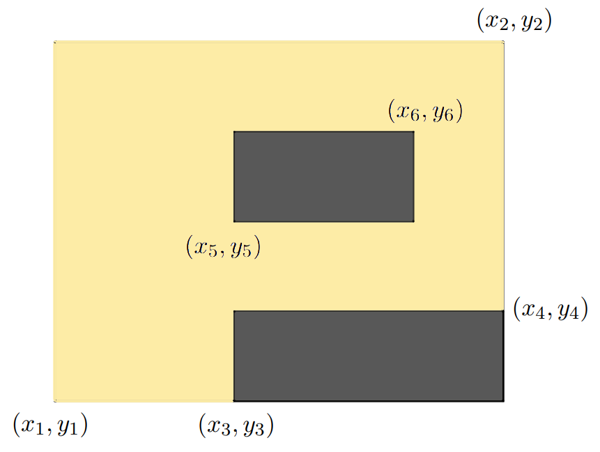

# Надпись на табло

[<kbd>algorithm</kbd>](https://contest.yandex.ru/contest/66792/problems/B/)

Вы получили доступ к одной из камер наблюдения в особо секретной огранизации. В зоне видимости камеры находится табло, с которого вы постоянно считываете информацию. Теперь вам нужно написать программу, которая по состоянию табло определяет, какая буква изображена на нём в данный момент. Табло представляет из себя квадратную таблицу, разбитую на $n×n$ равных квадратных светодиодов. Каждый диод либо включён, либо выключен. Введём систему координат, направив ось $O_X$ вправо, а ось $O_Y$ — вверх, приняв сторону диода равной 1.

На табло могут быть изображены только следующие буквы:

-   **I** - прямоугольник из горящих диодов.

*   **O** - прямоугольник из горящих диодов с углами $(x_1,y_1)$ и $(x_2,y_2)$, внутри которого есть прямоугольник из выключенных диодов с координатами углов $(x_3,y_3)$ и $(x_4,y_4)$. При этом границы выключенного прямоугольника не должны касаться внешнего, то есть $x_1<x_3<x_4<x_2$​ и $y_1<y_3<y_4<y_2$​.
*   **C** - прямоугольник из горящих диодов с углами $(x_1,y_1)$ и $(x_2,y_2)$, внутри которого есть прямоугольник из выключенных диодов с координатами углов $(x_3,y_3)$ и $(x_4,y_4)$. При этом правая граница выключенного прямоугольника находится на правой границе внешнего прямоугольника, то есть $x_1<x_3<x_4=x_2$​ и $y_1<y_3<y_4<y_2$.

    

*   **L** - прямоугольник из горящих диодов с углами $(x_1,y_1)$ и $(x_2,y_2)$, внутри которого есть прямоугольник из выключенных диодов с координатами углов $(x_3,y_3)$ и $(x_4,y_4)$. При этом правые верхние углы выключенного прямоугольника и внешнего прямоугольника совпадают, то есть $x_1<x_3<x_4=x_2$​ и $y_1<y_3<y_4=y_2$.

    

*   **P** - прямоугольник из горящих диодов с углами $(x_1,y_1)$ и $(x_2,y_2)$, внутри которого находятся 2 прямоугольника из выключенных диодов с координатами углов $(x_3,y_3)$, $(x_4,y_4)$ у первого и $(x_5,y_5)$, $(x_6,y_6)$ у второго. При этом правый нижний угол первого выключенного прямоугольника должен совпадать с правым нижним угломвнешнего прямоугольника, а другой выключенный прямоугольник должен находиться строго выше и не касаться границдругих прямоугольников, также левые границы двух выключенных прямоугольников должны совпадать, то есть $x_1<x_3=x_5<x_6<x_4=x_2$ и $y_1=y_3<y_4<y_5<y_6<y_2$​.

    

*   **X** - любое другое состояние табло.

По виду табло определите, какая буква на нём изображена.

<details>
<summary>Форматы ввода/вывода и примеры</summary>

## Формат ввода

В первой строке входных данных находится одно число $n$ $(1 \leq n \leq 10)$ — сторона табло.

В следующих nn строках находятся строки длины $n$ из символов «.» и «#» — строки таблицы. «.» обозначает выключенный квадратный диод табло, а «#» — горящий.

## Формат вывода

Программа должна вывести единственный символ: если данная таблица подходит под одно из описаний букв **I**, **O**, **C**, **L**, **H**, **P**, то выведите её (все буквы — английские). Если же данная таблица не подходит ни под какие условия, то выведите **X**.

### Пример 1

<table width = "100%">
<tr>
<th>Ввод</th> <th>Вывод</th>
</tr>
<tr valign="top">
<td><pre>
<code>4
.##.
.##.
.##.
....
</code></pre></td>

<td><pre>
<code>I
</code></pre></td>
</tr>
</table>

### Пример 2

<table width = "100%">
<tr>
<th>Ввод</th> <th>Вывод</th>
</tr>
<tr valign="top">
<td><pre>
<code>5
#...#
.#.#.
..#..
.#.#.
#...#
</code></pre></td>

<td><pre>
<code>X
</code></pre></td>
</tr>
</table>

</details>

<details>
<summary>Решение <kbd>javascript</kbd></summary>

### 1. Установка зависимостей

```bash
npm install             # Установка зависимостей
```

### 2. Запуск тестирования решения в среде Jest[^1]

```bash
npm run test            # Unit-тестирование
```

</details>

#### Ссылки на документацию

[^1]: [Jest](https://jestjs.io/docs/getting-started)
